# Architecture Overview

This document provides a comprehensive overview of the AWS infrastructure and architectural patterns used in this Next.js SST starter project.

## High-Level Architecture

The application uses a modern serverless architecture built on AWS, leveraging SST (Serverless Stack) for infrastructure as code and OpenNext for Next.js deployment optimization.

```
┌─────────────────────────────────────────────────────────────────┐
│                           Users/Clients                          │
└─────────────────────────┬───────────────────────────────────────┘
                          │
                          │ HTTPS Requests
                          ▼
┌─────────────────────────────────────────────────────────────────┐
│                      Amazon CloudFront                          │
│                    (Global CDN + SSL)                          │
└─────────────────────────┬───────────────────────────────────────┘
                          │
                          │ Routes to appropriate origin
                          ▼
┌─────────────────────────────────────────────────────────────────┐
│                    AWS Lambda@Edge                              │
│                  (Request/Response routing)                     │
└─────────────────────────┬───────────────────────────────────────┘
                          │
              ┌───────────┴──────────┐
              │                      │
              ▼                      ▼
    ┌─────────────────┐    ┌─────────────────┐
    │   Static Assets │    │   Dynamic Routes │
    │      (S3)       │    │   (Lambda)      │
    └─────────────────┘    └─────────┬───────┘
                                     │
                                     │ Email sending
                                     ▼
                           ┌─────────────────┐
                           │   Amazon SES    │
                           │ (Email Service) │
                           └─────────────────┘
```

## Core Components

### 1. SST (Serverless Stack) Framework

**Purpose**: Infrastructure as Code (IaC) framework built on top of AWS CDK and Pulumi
**Benefits**:

- Type-safe infrastructure definitions
- Live lambda development
- Automatic resource linking
- Stage-based deployments

**Key SST Constructs Used**:

- `sst.aws.Nextjs`: Next.js application deployment
- `sst.aws.Email`: SES email identity management
- `sst.aws.dns`: Route53 DNS management (when using custom domains)

## OpenNext Integration

**What is OpenNext?**
OpenNext enables Next.js applications to run on AWS Lambda. SST's Next.js construct uses OpenNext v3.6.2, which supports Next.js 15.3.2.

**Key Features for Our Project**:

- **Server-Side Rendering (SSR)**: Contact form and dynamic pages rendered on Lambda
- **Static Site Generation (SSG)**: Pre-built pages served from S3
- **API Routes**: Contact form API endpoint as serverless function
- **Middleware**: Edge computing for request/response processing (if needed)

**Project-Specific Edge Cases**:

- **Contact Form POST**: Handled via API route with SES integration
- **Environment Variables**: Deployment-specific variables managed through SST
- **ARM64 Optimization**: Uses Graviton2 processors for better cost/performance

## Detailed AWS Infrastructure

### CloudFront Distribution

```
CloudFront Distribution
├── Origin 1: S3 Bucket (Static Assets)
│   ├── _next/static/** (JS, CSS, Images)
│   ├── favicon.ico
│   └── Other static files
├── Origin 2: Lambda Function URL (Dynamic Content)
│   ├── API Routes (/api/*)
│   ├── SSR Pages
│   └── ISR Pages
└── Behaviors:
    ├── _next/static/** → S3 Origin
    ├── api/** → Lambda Origin
    └── /* → Lambda Origin (default)
```

**Cache Behaviors**:

- **Static Assets**: Long-term caching (1 year) with immutable content
- **API Routes**: No caching for dynamic responses
- **Pages**: Configurable caching based on Next.js page types

### Lambda Functions

The application is deployed as multiple Lambda functions:

1. **Main Server Function**

   - Handles SSR pages and API routes
   - Runtime: Node.js 18.x or 20.x
   - Memory: Configurable (default 1024MB)
   - Architecture: arm64 (Graviton2 for better performance/cost)

2. **Image Optimization Function** (if using Next.js Image component)

   - On-demand image resizing and optimization
   - Separate Lambda for better performance isolation

3. **Middleware Function** (if middleware.ts exists)
   - Edge-side request/response processing
   - Deployed to Lambda@Edge

### S3 Bucket Structure

```
S3 Bucket (Static Assets)
├── _next/
│   ├── static/
│   │   ├── chunks/        # Webpack chunks
│   │   ├── css/          # Compiled CSS
│   │   ├── js/           # JavaScript bundles
│   │   └── media/        # Static media files
│   └── cache/            # ISR cache (if applicable)
├── favicon.ico
└── [other static files]
```

### Simple Email Service (SES)

**Configuration**:

- **Domain Identity**: Verifies your domain for sending emails
- **Email Identity**: Verifies individual email addresses
- **DMARC Policy**: Anti-spam and security configuration

**Email Flow**:

```
Contact Form Submission
         ↓
   Form Validation (Zod)
         ↓
   API Route (/api/contact)
         ↓
   AWS SES Send Email
         ↓
   Recipient Email Inbox
```

## Deployment Configurations

### With Custom Domain

```typescript
new sst.aws.Nextjs("NextApp", {
  domain: {
    name: "yourdomain.com",
    dns: sst.aws.dns({
      zone: "YOUR_HOSTED_ZONE_ID",
    }),
  },
  // ... other config
});
```

**Infrastructure Created**:

- Route53 Hosted Zone (if not existing)
- ACM SSL Certificate
- CloudFront Distribution with custom domain
- DNS A/AAAA records pointing to CloudFront

### Without Custom Domain

```typescript
new sst.aws.Nextjs("NextApp", {
  // No domain configuration
  environment: {
    DEPLOYMENT_ENV: $app.stage,
  },
  // ... other config
});
```

**Infrastructure Created**:

- CloudFront Distribution with generated domain (e.g., `d123abc.cloudfront.net`)
- No SSL certificate needed (CloudFront provides default)
- No Route53 configuration required

## Performance Optimizations

### 1. Cold Start Mitigation

- **Provisioned Concurrency**: Can be enabled for production workloads
- **ARM64 Architecture**: Faster startup times and better performance/cost ratio
- **Bundle Optimization**: Tree shaking and code splitting via OpenNext

### 2. Caching Strategy

- **Static Assets**: Cached for 1 year with cache busting via file hashes
- **API Responses**: No caching by default, configurable per route
- **Page Caching**: ISR enables background updates without full rebuilds

### 3. Global Distribution

- **CloudFront Edge Locations**: 400+ edge locations worldwide
- **Regional Lambda**: Functions deployed in specific AWS regions
- **S3 Transfer Acceleration**: Faster uploads for global users

## Security Features

### 1. SSL/TLS Encryption

- **CloudFront SSL**: Automatic HTTPS with AWS-managed certificates
- **Custom Domain SSL**: ACM certificates for custom domains
- **TLS 1.2+ Only**: Modern encryption standards enforced

### 2. Access Control

- **CloudFront Origin Access Control (OAC)**: Secures S3 bucket access
- **Lambda Function URLs**: Controlled access to Lambda functions
- **CORS Configuration**: Proper cross-origin resource sharing settings

### 3. Email Security

- **SPF Records**: Sender Policy Framework for email authentication
- **DKIM**: DomainKeys Identified Mail for message integrity
- **DMARC**: Domain-based Message Authentication for anti-spoofing

## Monitoring and Observability

### Built-in AWS Monitoring

- **CloudWatch Logs**: Lambda function logs and errors
- **CloudWatch Metrics**: Performance and usage metrics
- **X-Ray Tracing**: Request tracing across services (optional)
- **CloudFront Metrics**: CDN performance and cache hit rates

### Recommended Additional Monitoring

- **SST Console**: Live development and deployment insights
- **AWS CloudWatch Dashboards**: Custom performance dashboards
- **Third-party APM**: DataDog, New Relic, or similar for enhanced monitoring

## Cost Optimization

### 1. Serverless Pricing Model

- **Pay-per-request**: No charges for idle time
- **CloudFront**: Pay for data transfer and requests
- **Lambda**: Pay for execution time and memory usage
- **S3**: Pay for storage and requests

### 2. ARM64 Architecture

- **20% Better Performance**: Graviton2 processors
- **Up to 34% Cost Savings**: Compared to x86_64 architecture

### 3. Efficient Caching

- **Reduced Lambda Invocations**: Static assets served from CloudFront
- **Lower Data Transfer Costs**: Edge caching reduces origin requests

## Scaling Characteristics

### Automatic Scaling

- **Lambda Concurrency**: Up to 1000 concurrent executions by default
- **CloudFront**: Automatically scales to handle traffic spikes
- **S3**: Virtually unlimited storage and request capacity

### Performance Limits

- **Lambda Timeout**: 15 minutes maximum (typically 30 seconds for web requests)
- **Payload Size**: 6MB for synchronous Lambda invocations
- **Cold Start**: ~100-500ms for Node.js functions on ARM64

## Development vs Production

### Development Stage

- **Faster Deployments**: Optimized for development speed
- **Debug Logging**: Enhanced logging for troubleshooting
- **Resource Removal**: Resources deleted when stage is destroyed
- **Separate SES Identities**: Development-specific email identities

### Production Stage

- **Resource Retention**: Critical resources retained on deletion
- **Performance Optimization**: Optimized bundle sizes and caching
- **Monitoring**: Enhanced monitoring and alerting
- **Backup Strategies**: Data backup and disaster recovery plans

## Migration and Deployment Strategies

### Blue-Green Deployment

SST supports blue-green deployments through stages:

```bash
npx sst deploy --stage blue
npx sst deploy --stage green
```

### Database Integration (Future)

When adding databases, consider:

- **RDS Serverless**: For relational data with variable workloads
- **DynamoDB**: For NoSQL requirements with predictable scaling
- **Aurora Serverless v2**: For complex relational queries with auto-scaling

## Troubleshooting Common Issues

### 1. Cold Starts

- **Symptoms**: Slow first request after idle period
- **Solutions**: Provisioned concurrency, keep-warm strategies

### 2. Bundle Size

- **Symptoms**: Slow deployments, large Lambda packages
- **Solutions**: Dynamic imports, proper tree shaking, bundle analysis

### 3. CORS Issues

- **Symptoms**: Browser blocking API requests
- **Solutions**: Proper CORS configuration in Next.js API routes

This architecture provides a robust, scalable, and cost-effective foundation for modern web applications while maintaining the flexibility to evolve with changing requirements.

## Infrastructure Diagrams

### AWS Resource Relationships

```mermaid
graph TB
    User[👤 User] --> CF[☁️ CloudFront Distribution]

    CF --> S3[🗄️ S3 Bucket<br/>Static Assets]
    CF --> Lambda[⚡ Lambda Function<br/>SSR & API Routes]
    CF --> Edge[🔄 Lambda@Edge<br/>Middleware]

    Lambda --> SES[📧 Amazon SES<br/>Email Service]

    subgraph "Custom Domain (Optional)"
        R53[🌐 Route53<br/>DNS]
        ACM[🔒 ACM Certificate<br/>SSL/TLS]
        R53 --> CF
        ACM --> CF
    end

    subgraph "Monitoring & Logs"
        CW[📊 CloudWatch<br/>Logs & Metrics]
        Lambda --> CW
        CF --> CW
    end

    subgraph "Development"
        SST[🛠️ SST CLI<br/>Infrastructure as Code]
        SST --> CF
        SST --> Lambda
        SST --> S3
        SST --> SES
    end
```



### Request Flow Architecture


### Deployment Process Flow

```mermaid
graph LR
    Dev[👨‍💻 Developer] --> Git[📚 Git Push]
    Git --> GHA[⚙️ GitHub Actions]

    GHA --> Build[🔨 Build Process]
    Build --> Upload[📤 Upload Assets]
    Upload --> Deploy[🚀 Deploy Infrastructure]

    Deploy --> CF[☁️ CloudFront Update]
    Deploy --> L[⚡ Lambda Update]
    Deploy --> SES[📧 SES Configuration]

    CF --> Live[🌐 Live Application]
    L --> Live
    SES --> Live
```



## Latest Compatibility & Project Setup (2025)

### Current Stack Versions

- **OpenNext**: v3.6.2 (supports Next.js 15.3.2)
- **Next.js**: 15.3.2 with App Router
- **SST**: v3.17+ with enhanced Next.js construct
- **Node.js**: 20.x (ARM64 recommended for cost savings)

### Project-Specific Configuration

**What's Included in This Starter**:

- ✅ Contact form with Server Actions and SES integration
- ✅ App Router with TypeScript support
- ✅ Turbopack development mode
- ✅ Environment variables through SST resource linking
- ✅ AWS SES email functionality with verification

**Edge Cases & Workarounds**:

1. **Windows Development**: Docker setup required for SST initialization
2. **Email Verification**: SES requires email verification in sandbox mode
3. **Build Process**: Stop SSO script before running builds (terminal conflicts)
4. **Environment Variables**: Use SST linking instead of manual env management

### OpenNext v3 Improvements

**Enhanced Performance:**

- **ARM64 Support**: Native support for AWS Graviton2 processors with up to 34% cost savings
- **Streaming SSR**: Improved streaming for better perceived performance
- **Edge Runtime Compatibility**: Better support for Edge Runtime APIs
- **Reduced Cold Starts**: Optimized bundle splitting and lazy loading

**Next.js 15 Compatibility & Features:**

**OpenNext Support**: Latest OpenNext v3.6.2 supports Next.js 15.3.2

**Core Next.js 15 Features:**

- **React 19 Support**: Full compatibility with React 19 RC and upcoming stable release
- **Async Request APIs**: Support for async `cookies()`, `headers()`, `params`, and `searchParams`
- **App Router Enhancements**: Complete App Router support with nested layouts and improved performance
- **Server Components**: Optimized React Server Components execution with better streaming
- **Server Actions**: Enhanced Server Actions with improved security (unguessable IDs, dead code elimination)
- **Turbopack Dev (Stable)**: Production-ready Turbopack for development with 76.7% faster startup
- **New `<Form>` Component**: Client-side navigation forms with prefetching and progressive enhancement
- **Enhanced Caching**: New caching semantics with opt-in caching for GET Route Handlers
- **Client Router Cache**: Improved cache behavior with `staleTime` configuration
- **TypeScript Config Support**: Native `next.config.ts` support with type checking

**Advanced Router Features:**

- **Parallel Routes**: Support for `@folder` parallel route segments
- **Intercepting Routes**: Support for `(.)folder` intercepting routes
- **Route Groups**: Support for `(group)` route organization
- **Dynamic Routes**: Enhanced `[slug]` and `[...slug]` dynamic routing with better performance

**Infrastructure Features:**

- **API Routes**: Full support for App Router API routes with improved performance
- **Middleware**: Edge runtime middleware support with better debugging
- **Image Optimization**: Automatic `sharp` installation for self-hosting, enhanced optimization
- **Font Optimization**: Automatic font optimization and loading with improved performance
- **Metadata API**: Complete metadata API support for SEO with better TypeScript integration

**Experimental Features:**

- **React Compiler (Experimental)**: React Compiler integration for automatic memoization
- **`unstable_after` API**: Execute code after response streaming completes
- **Partial Prerendering (PPR)**: Experimental PPR support for hybrid static/dynamic pages
- **Advanced Static Generation**: Configurable concurrency and retry options

**New Next.js 15 Features Supported:**

**Core Improvements:**

- **Enhanced Security**: Server Actions now use unguessable, non-deterministic IDs and dead code elimination
- **Improved Hydration Errors**: Better error messages with source code and fix suggestions
- **Static Route Indicator**: Visual indicator during development showing static vs dynamic routes
- **Better Bundle Analysis**: Enhanced bundle optimization and tree shaking
- **ESLint 9 Support**: Full compatibility with ESLint 9 and flat configuration
- **Self-hosting Improvements**: Better `Cache-Control` header control and automatic `sharp` installation

**Caching & Performance:**

- **New Default Caching**: GET Route Handlers and Client Router Cache are uncached by default (opt-in caching available)
- **Enhanced `fetch()` Caching**: Improved fetch caching with better invalidation strategies
- **Advanced Cache Control**: Fine-grained control over cache behaviors and expiration
- **Improved Build Performance**: Faster builds with optimized static generation workers
- **Server Components HMR**: Reused fetch responses during development for better performance

**Development Experience:**

- **`@next/codemod` CLI**: Automated upgrade assistance with enhanced tooling
- **Hot Module Replacement**: Improved HMR for Server Components with fetch response reuse
- **Better Error Handling**: Enhanced error boundaries and debugging capabilities
- **TypeScript Improvements**: Better TypeScript integration and performance
- **Development Indicators**: Visual indicators for route types and performance insights

**Infrastructure & Deployment:**

- **Optimized Bundle Packaging**: Better external package bundling with `bundlePagesRouterDependencies`
- **Enhanced Middleware**: Improved middleware execution with better performance isolation

## Implementing ISR (Incremental Static Regeneration)

ISR allows you to create static pages that can be updated without rebuilding the entire site. With OpenNext v3.6.2, ISR is fully supported with S3-based cache storage.

### Basic ISR Setup

**1. Time-based Revalidation (Simple)**

Create a page that revalidates every hour:

```typescript
// src/app/blog/page.tsx
export const revalidate = 3600; // Revalidate every hour

export default async function BlogPage() {
  const posts = await fetch('https://api.example.com/posts', {
    next: { revalidate: 3600 }
  });

  return (
    <div>
      {/* Your blog posts */}
    </div>
  );
}
```

**2. On-Demand Revalidation (Advanced)**

Create an API route to trigger revalidation:

```typescript
// src/app/api/revalidate/route.ts
import { revalidatePath } from "next/cache";
import { NextRequest, NextResponse } from "next/server";

export async function POST(request: NextRequest) {
  const { path } = await request.json();

  try {
    revalidatePath(path);
    return NextResponse.json({ revalidated: true });
  } catch (err) {
    return NextResponse.json({ error: "Error revalidating" }, { status: 500 });
  }
}
```

**3. Tag-based Revalidation**

For more granular control, use cache tags:

```typescript
// src/app/blog/[id]/page.tsx
export default async function BlogPost({ params }: { params: { id: string } }) {
  const post = await fetch(`https://api.example.com/posts/${params.id}`, {
    next: {
      revalidate: 3600,
      tags: ['posts', `post-${params.id}`]
    }
  });

  return <div>{/* Post content */}</div>;
}

// API route to revalidate specific tags
// src/app/api/revalidate-tag/route.ts
import { revalidateTag } from 'next/cache';

export async function POST(request: NextRequest) {
  const { tag } = await request.json();
  revalidateTag(tag);
  return NextResponse.json({ revalidated: true });
}
```

### OpenNext ISR Infrastructure

When you deploy with ISR, OpenNext automatically creates:

```
AWS Resources for ISR:
├── S3 Bucket: Static cache storage
├── DynamoDB Table: Cache metadata and tags
├── Lambda Functions: Cache management
└── CloudFront: CDN with cache invalidation
```

### CloudFront Cache Invalidation

**Important**: ISR updates the S3 cache, but CloudFront cache needs manual invalidation for immediate updates.

```typescript
// utils/cloudfront-invalidation.ts
import { CloudFrontClient, CreateInvalidationCommand } from "@aws-sdk/client-cloudfront";

const cloudFront = new CloudFrontClient({});

export async function invalidateCloudFrontPaths(paths: string[]) {
  await cloudFront.send(
    new CreateInvalidationCommand({
      DistributionId: process.env.CLOUDFRONT_DISTRIBUTION_ID,
      InvalidationBatch: {
        CallerReference: `${Date.now()}`,
        Paths: {
          Quantity: paths.length,
          Items: paths,
        },
      },
    }),
  );
}

// Usage in API route
export async function POST(request: NextRequest) {
  const { path } = await request.json();

  // Revalidate Next.js cache
  revalidatePath(path);

  // Invalidate CloudFront cache for immediate update
  await invalidateCloudFrontPaths([path]);

  return NextResponse.json({ revalidated: true });
}
```

### ISR Best Practices for This Project

**1. Cost Management**

- First 1,000 CloudFront invalidations per month are free
- Use wildcard paths (`/blog/*`) for multiple invalidations
- Consider using longer revalidation times for cost efficiency

**2. Contact Form Use Case**
Since our project focuses on a contact form, ISR is most useful for:

- Testimonials or feedback pages that update periodically
- Blog posts or documentation
- Product updates or announcements

**3. Environment Configuration**

```typescript
// sst.config.ts - ISR requires specific configuration
new sst.aws.Nextjs("NextApp", {
  environment: {
    CLOUDFRONT_DISTRIBUTION_ID: $interpolate`${nextApp.cloudfront.id}`,
  },
  // ISR works automatically with OpenNext - no special config needed
});
```

### Testing ISR Locally

```bash
# Build and test ISR behavior
npm run build
npm run start

# Check ISR cache hits/misses (development)
NEXT_PRIVATE_DEBUG_CACHE=1 npm run start
```

### Troubleshooting ISR Issues

**Common Issues**:

1. **Cache Not Updating**: Check revalidation time and CloudFront invalidation
2. **Build Errors**: Ensure `fetch` calls have proper error handling
3. **Missing Resources**: Verify AWS permissions for S3 and DynamoDB access

**Debug Commands**:

```bash
# Check build output for ISR pages
npm run build # Look for "(ISR)" in build output

# Test revalidation API
curl -X POST http://localhost:3000/api/revalidate \
  -H "Content-Type: application/json" \
  -d '{"path": "/blog"}'
```

> **📋 Note**: ISR requires Node.js runtime and is not supported with static exports. Our OpenNext setup handles this automatically.

## Performance Characteristics

**Cold Start Performance (ARM64 recommended)**:

- ~100-150ms for contact form API endpoints
- ~3-5ms warm execution times
- 34% cost savings vs x86_64 architecture

**Bundle Optimization for This Project**:

- Contact form uses Server Actions (reduces client JavaScript)
- Static assets cached via CloudFront edge locations
- ARM64 Graviton2 provides better performance/cost ratio
- ISR reduces API calls for static content

**ISR Performance Benefits**:

- Pre-rendered pages serve instantly from CloudFront
- Background regeneration doesn't block user requests
- Reduced server load for frequently accessed content

---

_For more details on specific AWS services and configurations, see the [AWS Deployment Guide](./aws-deployment.md)._
