# Architecture Overview

This document provides a comprehensive overview of the AWS infrastructure and architectural patterns used in this Next.js SST starter project.

## High-Level Architecture

The application uses a modern serverless architecture built on AWS, leveraging SST (Serverless Stack) for infrastructure as code and OpenNext for Next.js deployment optimization.

```
┌─────────────────────────────────────────────────────────────────┐
│                           Users/Clients                          │
└─────────────────────────┬───────────────────────────────────────┘
                          │
                          │ HTTPS Requests
                          ▼
┌─────────────────────────────────────────────────────────────────┐
│                      Amazon CloudFront                          │
│                    (Global CDN + SSL)                          │
└─────────────────────────┬───────────────────────────────────────┘
                          │
                          │ Routes to appropriate origin
                          ▼
┌─────────────────────────────────────────────────────────────────┐
│                    AWS Lambda@Edge                              │
│                  (Request/Response routing)                     │
└─────────────────────────┬───────────────────────────────────────┘
                          │
              ┌───────────┴──────────┐
              │                      │
              ▼                      ▼
    ┌─────────────────┐    ┌─────────────────┐
    │   Static Assets │    │   Dynamic Routes │
    │      (S3)       │    │   (Lambda)      │
    └─────────────────┘    └─────────┬───────┘
                                     │
                                     │ Email sending
                                     ▼
                           ┌─────────────────┐
                           │   Amazon SES    │
                           │ (Email Service) │
                           └─────────────────┘
```

## Core Components

### 1. SST (Serverless Stack) Framework

**Purpose**: Infrastructure as Code (IaC) framework built on top of AWS CDK and Pulumi
**Benefits**:

- Type-safe infrastructure definitions
- Live lambda development
- Automatic resource linking
- Stage-based deployments

**Key SST Constructs Used**:

- `sst.aws.Nextjs`: Next.js application deployment
- `sst.aws.Email`: SES email identity management
- `sst.aws.dns`: Route53 DNS management (when using custom domains)

### 2. OpenNext Integration

**What is OpenNext?**
OpenNext is an open-source implementation that enables Next.js applications to run on AWS Lambda and other serverless platforms. SST's Next.js construct uses OpenNext under the hood.

**Key Features**:

- **Server-Side Rendering (SSR)**: Dynamic pages rendered on Lambda
- **Static Site Generation (SSG)**: Pre-built pages served from S3
- **Incremental Static Regeneration (ISR)**: Background page updates
- **API Routes**: Serverless functions for backend logic
- **Middleware**: Edge computing for request/response processing

## Detailed AWS Infrastructure

### CloudFront Distribution

```
CloudFront Distribution
├── Origin 1: S3 Bucket (Static Assets)
│   ├── _next/static/** (JS, CSS, Images)
│   ├── favicon.ico
│   └── Other static files
├── Origin 2: Lambda Function URL (Dynamic Content)
│   ├── API Routes (/api/*)
│   ├── SSR Pages
│   └── ISR Pages
└── Behaviors:
    ├── _next/static/** → S3 Origin
    ├── api/** → Lambda Origin
    └── /* → Lambda Origin (default)
```

**Cache Behaviors**:

- **Static Assets**: Long-term caching (1 year) with immutable content
- **API Routes**: No caching for dynamic responses
- **Pages**: Configurable caching based on Next.js page types

### Lambda Functions

The application is deployed as multiple Lambda functions:

1. **Main Server Function**

   - Handles SSR pages and API routes
   - Runtime: Node.js 18.x or 20.x
   - Memory: Configurable (default 1024MB)
   - Architecture: arm64 (Graviton2 for better performance/cost)

2. **Image Optimization Function** (if using Next.js Image component)

   - On-demand image resizing and optimization
   - Separate Lambda for better performance isolation

3. **Middleware Function** (if middleware.ts exists)
   - Edge-side request/response processing
   - Deployed to Lambda@Edge

### S3 Bucket Structure

```
S3 Bucket (Static Assets)
├── _next/
│   ├── static/
│   │   ├── chunks/        # Webpack chunks
│   │   ├── css/          # Compiled CSS
│   │   ├── js/           # JavaScript bundles
│   │   └── media/        # Static media files
│   └── cache/            # ISR cache (if applicable)
├── favicon.ico
└── [other static files]
```

### Simple Email Service (SES)

**Configuration**:

- **Domain Identity**: Verifies your domain for sending emails
- **Email Identity**: Verifies individual email addresses
- **DMARC Policy**: Anti-spam and security configuration

**Email Flow**:

```
Contact Form Submission
         ↓
   Form Validation (Zod)
         ↓
   API Route (/api/contact)
         ↓
   AWS SES Send Email
         ↓
   Recipient Email Inbox
```

## Deployment Configurations

### With Custom Domain

```typescript
new sst.aws.Nextjs("NextApp", {
  domain: {
    name: "yourdomain.com",
    dns: sst.aws.dns({
      zone: "YOUR_HOSTED_ZONE_ID",
    }),
  },
  // ... other config
});
```

**Infrastructure Created**:

- Route53 Hosted Zone (if not existing)
- ACM SSL Certificate
- CloudFront Distribution with custom domain
- DNS A/AAAA records pointing to CloudFront

### Without Custom Domain

```typescript
new sst.aws.Nextjs("NextApp", {
  // No domain configuration
  environment: {
    DEPLOYMENT_ENV: $app.stage,
  },
  // ... other config
});
```

**Infrastructure Created**:

- CloudFront Distribution with generated domain (e.g., `d123abc.cloudfront.net`)
- No SSL certificate needed (CloudFront provides default)
- No Route53 configuration required

## Performance Optimizations

### 1. Cold Start Mitigation

- **Provisioned Concurrency**: Can be enabled for production workloads
- **ARM64 Architecture**: Faster startup times and better performance/cost ratio
- **Bundle Optimization**: Tree shaking and code splitting via OpenNext

### 2. Caching Strategy

- **Static Assets**: Cached for 1 year with cache busting via file hashes
- **API Responses**: No caching by default, configurable per route
- **Page Caching**: ISR enables background updates without full rebuilds

### 3. Global Distribution

- **CloudFront Edge Locations**: 400+ edge locations worldwide
- **Regional Lambda**: Functions deployed in specific AWS regions
- **S3 Transfer Acceleration**: Faster uploads for global users

## Security Features

### 1. SSL/TLS Encryption

- **CloudFront SSL**: Automatic HTTPS with AWS-managed certificates
- **Custom Domain SSL**: ACM certificates for custom domains
- **TLS 1.2+ Only**: Modern encryption standards enforced

### 2. Access Control

- **CloudFront Origin Access Control (OAC)**: Secures S3 bucket access
- **Lambda Function URLs**: Controlled access to Lambda functions
- **CORS Configuration**: Proper cross-origin resource sharing settings

### 3. Email Security

- **SPF Records**: Sender Policy Framework for email authentication
- **DKIM**: DomainKeys Identified Mail for message integrity
- **DMARC**: Domain-based Message Authentication for anti-spoofing

## Monitoring and Observability

### Built-in AWS Monitoring

- **CloudWatch Logs**: Lambda function logs and errors
- **CloudWatch Metrics**: Performance and usage metrics
- **X-Ray Tracing**: Request tracing across services (optional)
- **CloudFront Metrics**: CDN performance and cache hit rates

### Recommended Additional Monitoring

- **SST Console**: Live development and deployment insights
- **AWS CloudWatch Dashboards**: Custom performance dashboards
- **Third-party APM**: DataDog, New Relic, or similar for enhanced monitoring

## Cost Optimization

### 1. Serverless Pricing Model

- **Pay-per-request**: No charges for idle time
- **CloudFront**: Pay for data transfer and requests
- **Lambda**: Pay for execution time and memory usage
- **S3**: Pay for storage and requests

### 2. ARM64 Architecture

- **20% Better Performance**: Graviton2 processors
- **Up to 34% Cost Savings**: Compared to x86_64 architecture

### 3. Efficient Caching

- **Reduced Lambda Invocations**: Static assets served from CloudFront
- **Lower Data Transfer Costs**: Edge caching reduces origin requests

## Scaling Characteristics

### Automatic Scaling

- **Lambda Concurrency**: Up to 1000 concurrent executions by default
- **CloudFront**: Automatically scales to handle traffic spikes
- **S3**: Virtually unlimited storage and request capacity

### Performance Limits

- **Lambda Timeout**: 15 minutes maximum (typically 30 seconds for web requests)
- **Payload Size**: 6MB for synchronous Lambda invocations
- **Cold Start**: ~100-500ms for Node.js functions on ARM64

## Development vs Production

### Development Stage

- **Faster Deployments**: Optimized for development speed
- **Debug Logging**: Enhanced logging for troubleshooting
- **Resource Removal**: Resources deleted when stage is destroyed
- **Separate SES Identities**: Development-specific email identities

### Production Stage

- **Resource Retention**: Critical resources retained on deletion
- **Performance Optimization**: Optimized bundle sizes and caching
- **Monitoring**: Enhanced monitoring and alerting
- **Backup Strategies**: Data backup and disaster recovery plans

## Migration and Deployment Strategies

### Blue-Green Deployment

SST supports blue-green deployments through stages:

```bash
npx sst deploy --stage blue
npx sst deploy --stage green
```

### Database Integration (Future)

When adding databases, consider:

- **RDS Serverless**: For relational data with variable workloads
- **DynamoDB**: For NoSQL requirements with predictable scaling
- **Aurora Serverless v2**: For complex relational queries with auto-scaling

## Troubleshooting Common Issues

### 1. Cold Starts

- **Symptoms**: Slow first request after idle period
- **Solutions**: Provisioned concurrency, keep-warm strategies

### 2. Bundle Size

- **Symptoms**: Slow deployments, large Lambda packages
- **Solutions**: Dynamic imports, proper tree shaking, bundle analysis

### 3. CORS Issues

- **Symptoms**: Browser blocking API requests
- **Solutions**: Proper CORS configuration in Next.js API routes

This architecture provides a robust, scalable, and cost-effective foundation for modern web applications while maintaining the flexibility to evolve with changing requirements.

## Infrastructure Diagrams

### AWS Resource Relationships

```mermaid
graph TB
    User[👤 User] --> CF[☁️ CloudFront Distribution]

    CF --> S3[🗄️ S3 Bucket<br/>Static Assets]
    CF --> Lambda[⚡ Lambda Function<br/>SSR & API Routes]
    CF --> Edge[🔄 Lambda@Edge<br/>Middleware]

    Lambda --> SES[📧 Amazon SES<br/>Email Service]

    subgraph "Custom Domain (Optional)"
        R53[🌐 Route53<br/>DNS]
        ACM[🔒 ACM Certificate<br/>SSL/TLS]
        R53 --> CF
        ACM --> CF
    end

    subgraph "Monitoring & Logs"
        CW[📊 CloudWatch<br/>Logs & Metrics]
        Lambda --> CW
        CF --> CW
    end

    subgraph "Development"
        SST[🛠️ SST CLI<br/>Infrastructure as Code]
        SST --> CF
        SST --> Lambda
        SST --> S3
        SST --> SES
    end
```



### Request Flow Architecture


### Deployment Process Flow

```mermaid
graph LR
    Dev[👨‍💻 Developer] --> Git[📚 Git Push]
    Git --> GHA[⚙️ GitHub Actions]

    GHA --> Build[🔨 Build Process]
    Build --> Upload[📤 Upload Assets]
    Upload --> Deploy[🚀 Deploy Infrastructure]

    Deploy --> CF[☁️ CloudFront Update]
    Deploy --> L[⚡ Lambda Update]
    Deploy --> SES[📧 SES Configuration]

    CF --> Live[🌐 Live Application]
    L --> Live
    SES --> Live
```



## Latest OpenNext & SST Features (2025)

### OpenNext v3 Improvements

**Enhanced Performance:**

- **ARM64 Support**: Native support for AWS Graviton2 processors with up to 34% cost savings
- **Streaming SSR**: Improved streaming for better perceived performance
- **Edge Runtime Compatibility**: Better support for Edge Runtime APIs
- **Reduced Cold Starts**: Optimized bundle splitting and lazy loading

**Next.js 15 Compatibility:**

- **App Router**: Full support for Next.js App Router patterns
- **Server Components**: Optimized React Server Components execution
- **Turbopack**: Development mode improvements with Turbopack integration
- **Partial Prerendering**: Support for experimental partial prerendering

**Advanced Caching:**

- **Incremental Static Regeneration (ISR)**: Improved ISR with S3-based cache
- **On-Demand Revalidation**: API-triggered cache invalidation
- **Tag-based Revalidation**: Cache invalidation by tags

### SST v3 Next.js Construct Features

**Type-Safe Infrastructure:**

```typescript
// Enhanced type safety with SST v3
const nextApp = new sst.aws.Nextjs("NextApp", {
  // Fully typed configuration options
  buildCommand: "npm run build",

  // Enhanced Lambda configuration
  lambda: {
    runtime: "nodejs20.x", // Latest Node.js runtime
    architecture: "arm64", // Graviton2 processors
    memory: "1024 MB", // Configurable memory
    timeout: "30 seconds", // Configurable timeout
    environment: {
      // Type-safe environment variables
      NODE_ENV: "production",
    },
  },

  // Advanced CloudFront configuration
  cloudfront: {
    comment: "Next.js App Distribution",
    priceClass: "PriceClass_All",
    compress: true,

    // Custom cache behaviors
    additionalBehaviors: {
      "/api/*": {
        cachePolicy: "CachingDisabled",
        originRequestPolicy: "AllViewer",
      },
    },
  },

  // Resource linking for type-safe access
  link: [sesEmail, database], // Auto-typed in your app
});
```

**Live Development:**

- **SST Console**: Real-time function logs and metrics
- **Local Development**: Lambda functions run locally with `sst dev`
- **Hot Reload**: Instant updates without full redeployment
- **Environment Sync**: Local environment matches deployed infrastructure

**Advanced Deployment Features:**

- **Blue-Green Deployments**: Zero-downtime deployments through stages
- **Rollback Capabilities**: Quick rollback to previous versions
- **Canary Releases**: Gradual traffic shifting for safer deployments
- **Multi-Region**: Deploy to multiple AWS regions simultaneously

### Performance Benchmarks

**Cold Start Performance (ARM64 vs x86_64):**

```
ARM64 (Graviton2):
├── Cold Start: ~150ms (Node.js 20.x)
├── Warm Execution: ~5ms
└── Memory Efficiency: +20% better

x86_64 (Intel):
├── Cold Start: ~200ms (Node.js 20.x)
├── Warm Execution: ~6ms
└── Cost: 34% higher than ARM64
```

**Bundle Size Optimizations:**

- **Tree Shaking**: Aggressive dead code elimination
- **Code Splitting**: Automatic route-based splitting
- **Compression**: Brotli compression for smaller payloads
- **Modern JavaScript**: ES2022 target for smaller bundles

### Migration from Other Platforms

**From Vercel:**

```typescript
// Vercel equivalent features in SST
new sst.aws.Nextjs("NextApp", {
  // Vercel's ISR equivalent
  experimental: {
    incrementalCacheHandlerPath: "./cache-handler.js",
  },

  // Vercel's Edge Functions equivalent
  middleware: "./middleware.ts",

  // Vercel's Analytics equivalent (via CloudWatch)
  cloudfront: {
    webAclId: webAcl.id, // AWS WAF for bot protection
  },
});
```

**From Netlify:**

```typescript
// Netlify equivalent features
new sst.aws.Nextjs("NextApp", {
  // Netlify Functions equivalent
  api: {
    routes: {
      "POST /api/contact": "./src/api/contact.ts",
    },
  },

  // Netlify Forms equivalent (via SES integration)
  link: [sesEmail],
});
```

### Advanced Configuration Examples

**Multi-Environment Setup:**

```typescript
// Production optimizations
const prodConfig = isProd($app.stage)
  ? {
      lambda: {
        runtime: "nodejs20.x",
        architecture: "arm64",
        memory: "2048 MB",
        provisionedConcurrency: 10, // Eliminate cold starts
      },
      cloudfront: {
        priceClass: "PriceClass_All",
        compress: true,

        // Production caching strategy
        additionalBehaviors: {
          "/_next/static/*": {
            cachePolicy: "CachingOptimized",
            compress: true,
            viewerProtocolPolicy: "redirect-to-https",
          },
        },
      },
    }
  : {
      // Development optimizations
      lambda: {
        memory: "1024 MB",
        // No provisioned concurrency for dev
      },
      cloudfront: {
        priceClass: "PriceClass_100", // North America & Europe only
      },
    };

new sst.aws.Nextjs("NextApp", {
  ...baseConfig,
  ...prodConfig,
});
```

**Database Integration:**

```typescript
// PostgreSQL with RDS
const database = new sst.aws.Postgres("Database", {
  engine: "postgres15.4",
  scaling: {
    min: isProd($app.stage) ? 0.5 : 0,
    max: isProd($app.stage) ? 16 : 2,
  },
});

// Next.js app with database link
new sst.aws.Nextjs("NextApp", {
  link: [database],
  environment: {
    DATABASE_URL: database.connectionString,
  },
});
```

**Custom Cache Layer:**

```typescript
// Redis for session storage and caching
const redis = new sst.aws.Redis("Cache", {
  engine: "redis7.x",
  nodeType: "cache.t3.micro",
});

new sst.aws.Nextjs("NextApp", {
  link: [redis],
  environment: {
    REDIS_URL: redis.connectionString,
  },
});
```

### Best Practices for 2025

1. **Use ARM64 Architecture**: 34% cost savings with better performance
2. **Implement Proper Caching**: Leverage CloudFront and application-level caching
3. **Monitor Performance**: Use CloudWatch and X-Ray for observability
4. **Security First**: Implement WAF, proper IAM roles, and environment isolation
5. **Cost Optimization**: Use appropriate instance sizes and pricing classes
6. **Type Safety**: Leverage SST's type-safe resource linking
7. **Multi-Environment**: Separate dev/staging/prod environments with appropriate configurations
